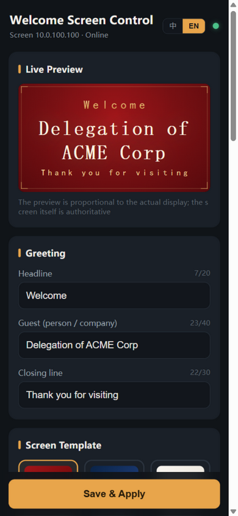
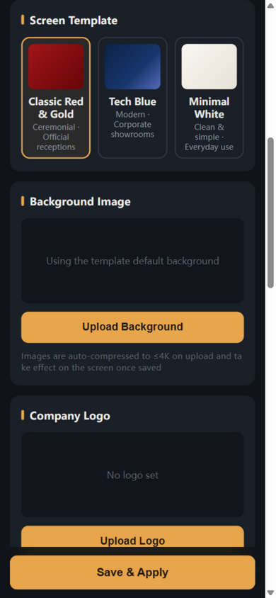
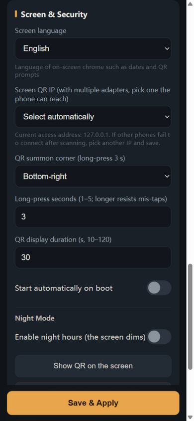

# Welcome Screen

[](https://github.com/panlatent/welcome-screen/actions/workflows/ci.yml)
[](https://github.com/panlatent/welcome-screen/releases)
[](LICENSE)

**English** | [简体中文](README.zh-CN.md)

A kiosk **welcome-screen app for Windows**. The big touch screen in your lobby or
reception area renders a fullscreen greeting; staff edit the welcome text, background,
and template from their **phone** by scanning a QR code shown on the screen — no cloud
service, no account, everything works over the local network.

Built with **Tauri 2 + Vue 3 + TypeScript** on the frontend and **Rust (axum)** for the
embedded HTTP service.

**The big screen** — three built-in templates:

|                           Red & Gold                            |                          Deep Blue                           |                            Minimal White                             |
| :-------------------------------------------------------------: | :----------------------------------------------------------: | :------------------------------------------------------------------: |
|  |  |  |

**Night mode** dims the screen to a low-brightness clock outside opening hours:


**English mode** — greeting defaults and screen chrome (dates) follow the configured
language:


**The phone control page** (opened by scanning the QR code — live preview while you type):

|                                Editing                                 |                                  Templates                                  |                              Screen & security                               |
| :--------------------------------------------------------------------: | :-------------------------------------------------------------------------: | :--------------------------------------------------------------------------: |
|  |  |  |

## How it works

```
┌────────────────────────── Windows kiosk ──────────────────────────┐
│                                                                   │
│  ┌────────────────┐  Tauri events  ┌───────────────────────────┐  │
│  │ Main window    │ ◄───────────── │ Rust core (tauri + axum)  │  │
│  │ fullscreen UI  │                │ HTTP API · config · files │  │
│  └────────────────┘                └───────────────────────────┘  │
│        ▲ QR (hidden; long-press bottom corner to summon)          │
└────────┼──────────────────────────────────────────────────────────┘
         │ scan
   ┌─────▼──────┐        HTTP (LAN, token in URL)
   │   Phone    │ ────────────────────────────────► same server
   └────────────┘
```

The control page for phones is built from the same repository and **served by the app
itself** — there is nothing to deploy, and the screen and phone always run matching
versions. Changes made on the phone are pushed to the big screen over Tauri events and
take effect within a second, with a smooth cross-fade.

## Features

- **Three built-in templates** — Red & Gold (ceremonial), Deep Blue (tech), Minimal
  White (everyday), each with custom background image and logo support
- **Display elements** — clock (12/24h, optional seconds), date, scrolling marquee
  (three speeds), individually toggleable
- **Hidden QR code** — completely invisible during normal use; long-press the bottom
  corner for 1–5 seconds (configurable) to summon it, auto-hides after 10–120 seconds
- **First-run setup mode** — on a fresh install the QR code stays on screen until the
  first phone connects and saves; with multiple network adapters, a QR code is shown
  for each of them at once
- **No phone needed** — a button under the QR code opens the control page in the
  kiosk's own browser (loopback URL, unaffected by firewall rules or adapter choice)
- **Live preview** — the control page renders a scaled 16:9 preview of the actual
  template while you type
- **Wide-screen layout** — on viewports ≥1024px wide the control page switches to a
  two-column layout with a sticky live preview beside the form; phones keep the
  single-column layout
- **History & drafts** — recently used greetings are one tap away; unsaved edits are
  kept as a local draft with a dirty indicator
- **Night mode** — schedule a period (supports overnight ranges, e.g. 22:00–07:00)
  where the screen dims to a low-brightness clock to protect the panel
- **Multi-NIC aware** — pick which network adapter's IP the QR code uses when the
  screen has both Ethernet and Wi-Fi
- **Welcome profiles** — save multiple looks (template, greeting, background,
  logo, display elements) as named profiles and switch the screen with one tap;
  device settings (language, network, night mode, QR, auto-start) stay unchanged
- **Config management** — export/import a JSON config (for fleet deployments) and
  one-click reset of display settings
- **Instant apply** — saves take effect on the big screen in about one second
- **Security** — connection token embedded in the QR URL, one-click reset invalidates
  old links; server-side validation of all inputs; single-instance enforcement
- **Auto-start on boot** — toggle in the control page, persisted to the registry
- **Burn-in protection** — slow content drift and background zoom keep pixels moving
- **PWA** — the control page can be added to the phone's home screen with remembered
  token (no rescan needed)
- **Bilingual UI (中文 / English)** — the control page has a language toggle;
  on-screen chrome (dates, QR prompts) follows a configurable screen language
  with system-locale auto-detection

## Getting started

### Download

Grab the latest `WelcomeScreen_x.x.x_x64-setup.exe` from
[Releases](https://github.com/panlatent/welcome-screen/releases) and install it. Windows 10 (1809+) or 11 with
WebView2 Runtime is required (the installer downloads it if missing).

> **SmartScreen warning**: the installer is not code-signed, so Microsoft Defender
> SmartScreen may show "Windows protected your PC". Click "More info" → "Run anyway",
> or build from source yourself.

### Usage

1. Install and launch — the screen enters fullscreen; on first run the QR setup page
   is shown until a phone connects
2. On the phone (same network as the screen), scan the QR code to open the control
   page — no app install needed, scanning is all it takes
3. Edit the greeting / template / background / elements and tap **Save**
4. After setup completes the QR page disappears; long-press the bottom corner of the
   screen to summon it again for additional phones
5. In "Screen & security" you can enable auto-start, choose the QR IP (multi-NIC),
   reset the token, and schedule night mode

If scanning fails, see the [FAQ](#faq).

### Build from source

Requirements: Node.js ≥ 20, Rust ≥ 1.90 (MSVC toolchain), Windows 10/11.

```bash
npm install
npm run build:control   # build the phone control page once (served by the app)
npm run tauri dev       # run the kiosk app with hot reload
npm run tauri build     # produce the NSIS installer
```

The regression API tests assume the app is running locally (default port 7480,
override with the `PORT` environment variable):

```bash
node scripts/regression-test.mjs
```

The script backs up `config.json`, `profiles.json` and `files/` before running and
restores them afterwards; restart the app after a run so it reloads the restored
config.

## Development

```
├── index.html / src/            # big-screen renderer (main window)
├── control.html / src-control/  # phone control page (served by the app)
├── shared/                      # types, time utils, template components (both sides)
└── src-tauri/
    ├── src/config.rs            # config/profile models + persistence (appData/*.json)
    └── src/server.rs            # axum: API, auth, uploads, static control page
```

- `npm run dev` serves only the big-screen page for browser preview
  (`?tpl=tech-blue&night=1&lang=en` query params help debugging); Tauri APIs are unavailable
  there and defaults are used
- The phone control page is a separate Vite entry (`npm run build:control`) mounted by
  the Rust server at `/c/`
- All user data lives in `%APPDATA%/io.github.panlatent.welcomescreen/`

## FAQ

**How do I configure the screen without a phone?**
Summon the QR code (long-press the bottom corner; a fresh install shows it anyway)
and tap "Open on this PC" below it — the control page opens in the kiosk's own
browser over the loopback address, no scanning involved.

**The phone cannot open the control page after scanning.**
Phone and screen must be on the same LAN. Corporate Wi-Fi with AP isolation or guest
networks will block this — ask IT to allow it, or switch the screen to a reachable
network. In setup mode the screen shows one QR code per network adapter, so try each.

**Multiple network adapters — which IP does the QR use?**
By default the default-route adapter. If phones live on another subnet, pick the right
IP in the control page ("Screen & security" → QR IP). Virtual adapters (Docker/WSL/
Hyper-V) may appear in the list; that is harmless, just pick the one your phones use.

**Windows Firewall blocks connections.**
On first launch Windows may ask to allow the app on private networks — accept it. If
the network is classified as "Public", inbound connections are blocked by default.

**Is the installer safe to run despite SmartScreen?**
The binaries are not code-signed yet. You can verify by building from source, or check
the SHA256 checksum published with each release.

**Where is my data?**
`%APPDATA%/io.github.panlatent.welcomescreen/` — `config.json`, `profiles.json`
(saved welcome profiles) plus uploaded images in `files/`. Uninstalling the app
keeps this data.

## Roadmap

- [ ] Multiple greetings with scheduled rotation
- [ ] Background image playlists
- [ ] Video backgrounds
- [ ] Crash watchdog for unattended kiosks
- [ ] Fleet management (multiple screens from one control page)

## Contributing

Contributions are welcome! See [CONTRIBUTING.md](CONTRIBUTING.md). Please note the
[Code of Conduct](CODE_OF_CONDUCT.md). For security issues, see
[SECURITY.md](SECURITY.md) — do not open public issues for vulnerabilities.

## License

[MIT](LICENSE) © 2026 panlatent
