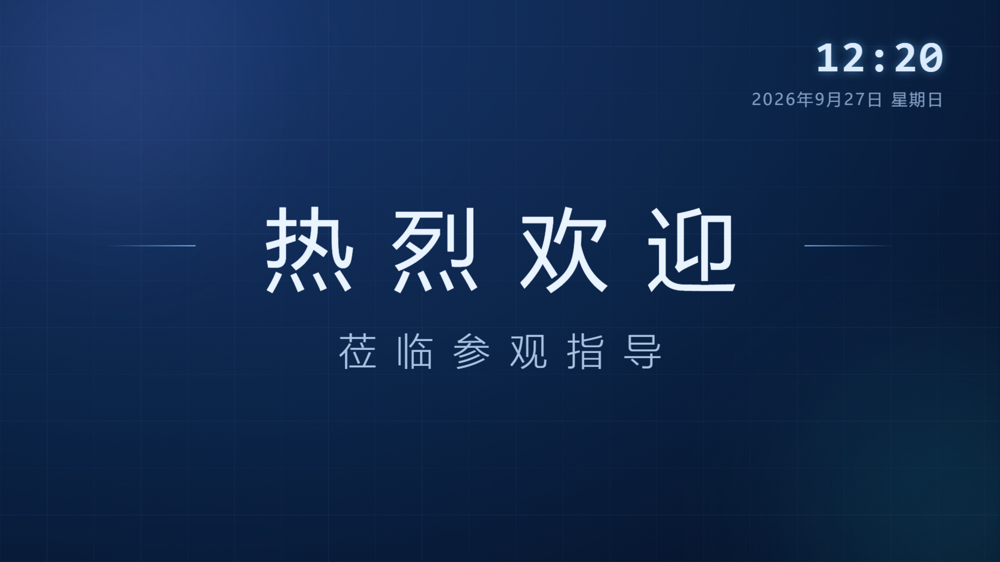
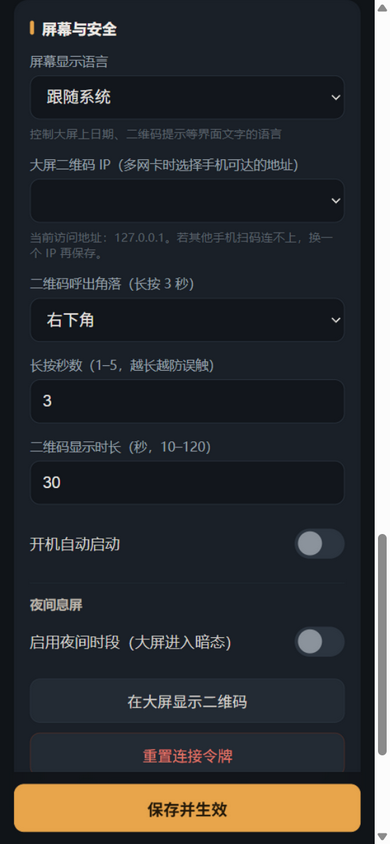
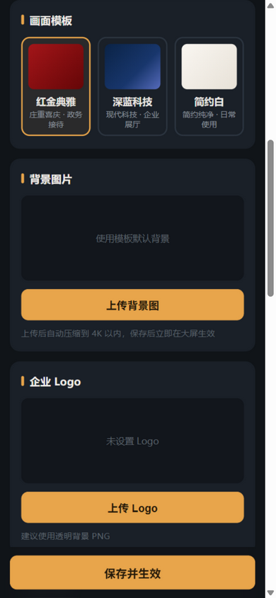
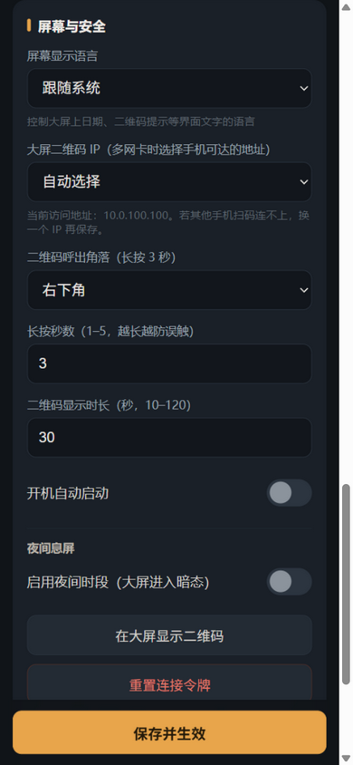

# Welcome Screen

[](https://github.com/panlatent/welcome-screen/actions/workflows/ci.yml)
[](https://github.com/panlatent/welcome-screen/releases)
[](LICENSE)

[English](README.md) | **简体中文**

运行在 **Windows 大屏（触控一体机）** 上的欢迎词/欢迎画面应用。大堂或接待处的屏幕
全屏渲染欢迎画面；工作人员用**手机**扫码连接大屏内置的控制页面，即可修改欢迎词、
背景图、模板——无需云服务、无需注册账号，一切都在局域网内完成。

技术栈：**Tauri 2 + Vue 3 + TypeScript** 前端，**Rust (axum)** 内嵌 HTTP 服务。

**大屏画面** —— 三套内置模板：

|                         红金典雅                         |                        深蓝科技                        |                          简约白                          |
| :------------------------------------------------------: | :----------------------------------------------------: | :------------------------------------------------------: |
|  |  |  |

**夜间模式** 在设定时段将大屏调暗为低亮度时钟，保护屏幕：


**手机控制端**（扫码打开，输入时实时预览）：

|                        编辑欢迎词                        |                          选择模板                           |                          屏幕与安全                          |
| :------------------------------------------------------: | :---------------------------------------------------------: | :----------------------------------------------------------: |
|  |  |  |

## 工作原理

```
┌────────────────────────── Windows 大屏 ──────────────────────────┐
│                                                                  │
│  ┌────────────────┐  Tauri 事件  ┌───────────────────────────┐   │
│  │ 主窗口          │ ◄──────────── │ Rust 核心 (tauri + axum)  │   │
│  │ 全屏渲染        │               │ HTTP API · 配置 · 文件     │   │
│  └────────────────┘               └───────────────────────────┘   │
│        ▲ 二维码（默认隐藏，长按底角呼出）                           │
└────────┼─────────────────────────────────────────────────────────┘
         │ 扫码
   ┌─────▼──────┐        HTTP（局域网，URL 内含令牌）
   │   手机      │ ───────────────────────────────► 同一服务
   └────────────┘
```

手机控制端页面由同一仓库构建、**由应用自身分发**——没有任何东西需要单独部署，大屏
与控制端的版本天然一致。手机保存后通过 Tauri 事件推送到大屏，约一秒内带淡入淡出
生效。

## 功能

- **三套内置模板**——红金典雅（政务庆典）、深蓝科技（企业展厅）、简约白（日常），
  均支持自定义背景图与 Logo
- **显示元素**——时钟（12/24 小时制、可选秒显示）、日期、滚动字幕（三档速度），
  独立开关
- **隐藏二维码**——日常使用完全不可见；长按屏幕底角 1–5 秒（可配置）呼出，
  10–120 秒后自动隐藏
- **首次部署引导**——全新安装后二维码常驻显示，直到第一部手机连接并保存；
  多网卡时同时展示每个网段的二维码
- **无需手机**——二维码下方一键在大屏本机的浏览器打开控制页（走 127.0.0.1
  回环地址，不受防火墙与网卡选择影响）
- **实时预览**——控制端在输入时实时渲染与实际画面等比的 16:9 预览
- **宽屏适配**——控制页在 ≥1024px 宽度下切换为两栏布局：左侧实时预览常驻、
  右侧表单；手机端保持单栏不变
- **历史与草稿**——最近使用的欢迎词一键回填；未保存修改自动暂存并提醒
- **夜间息屏**——设定时段（支持跨零点，如 22:00–07:00）大屏自动进入低亮度时钟
  暗态，保护屏幕
- **多网卡感知**——大屏同时接有线和无线时，可指定二维码使用哪个网卡的 IP
- **欢迎方案**——把模板、欢迎词、背景、Logo、显示元素保存为多套命名方案，
  一键切换大屏画面；语言、网络、夜间时段、二维码、自启动等设备级设置保持不变
- **配置管理**——导出/导入 JSON 配置（多屏部署复用）、一键恢复默认画面设置
- **即时生效**——保存后大屏约一秒内切换画面
- **安全**——连接令牌内置于二维码 URL，一键重置即可让旧链接全部失效；
  所有输入服务端校验；单实例运行
- **开机自启**——控制端开关，写入注册表
- **防烧屏**——内容缓慢漂移、背景缓慢缩放，避免像素长期静止
- **PWA**——控制端可添加到手机主屏幕，令牌自动记忆（无需重复扫码）
- **中英文双语**——控制端顶栏一键切换语言；大屏界面文字（日期、二维码提示等）
  支持跟随系统或指定语言

## 快速开始

### 下载安装

从 [Releases](https://github.com/panlatent/welcome-screen/releases) 下载最新的
`WelcomeScreen_x.x.x_x64-setup.exe` 安装。需要 Windows 10（1809+）或 11 及
WebView2 运行时（安装器缺失时自动下载）。

> **SmartScreen 警告**：安装包尚未代码签名，可能提示"Windows 已保护你的电脑"。
> 点击"更多信息"→"仍要运行"，或自行从源码构建。

### 使用

1. 安装并启动——大屏进入全屏；首次运行显示二维码引导页，直到有手机连接
2. 手机（与大屏同一网络）扫码打开控制页——无需安装任何 App
3. 修改欢迎词 / 模板 / 背景 / 元素，点击**保存并生效**
4. 引导完成后二维码页消失；再次需要连接时长按屏幕底角呼出
5. "屏幕与安全"中可开启开机自启、选择二维码 IP（多网卡）、重置令牌、设置夜间息屏

扫码失败请看[常见问题](#常见问题)。

### 从源码构建

环境要求：Node.js ≥ 20、Rust ≥ 1.90（MSVC 工具链）、Windows 10/11。

```bash
npm install
npm run build:control   # 先构建一次手机控制端（由应用分发）
npm run tauri dev       # 开发模式运行大屏应用
npm run tauri build     # 产出 NSIS 安装包
```

回归测试需要应用在本地运行中（默认端口 7480，可用环境变量 `PORT` 覆盖）：

```bash
node scripts/regression-test.mjs
```

脚本运行前会自动备份 `config.json`、`profiles.json` 与 `files/`，结束后恢复；跑完
请重启应用以重新加载恢复后的配置。

## 开发结构

```
├── index.html / src/            # 大屏渲染端（主窗口）
├── control.html / src-control/  # 手机控制端（由应用分发）
├── shared/                      # 类型、时间工具、模板组件（两端共用）
└── src-tauri/
    ├── src/config.rs            # 配置/方案模型与持久化（appData/*.json）
    └── src/server.rs            # axum：API、鉴权、上传、控制端静态分发
```

- `npm run dev` 仅在浏览器预览大屏页面（可用 `?tpl=tech-blue&night=1&lang=en`
  参数调试），该环境无 Tauri API，使用默认配置
- 手机控制端是独立的 Vite 入口（`npm run build:control`），由 Rust 服务挂载在
  `/c/` 路径
- 所有用户数据位于 `%APPDATA%/io.github.panlatent.welcomescreen/`

## 常见问题

**没有手机怎么配置大屏？**
长按屏幕底角呼出二维码（全新安装时本来就常驻显示），点击二维码下方的
「在本机浏览器打开」按钮——控制页会在大屏本机的浏览器中通过回环地址打开，
全程无需扫码。

**扫码后手机打不开控制页。**
手机与大屏必须在同一局域网。公司 Wi-Fi 的 AP 隔离或访客网络会阻断访问——联系 IT
放行，或让大屏改接可达的网络。部署引导模式下大屏会为每个网卡显示一张二维码，
可以逐一尝试。

**多个网卡时二维码用哪个 IP？**
默认使用默认路由网卡。若手机在另一网段，在控制端"屏幕与安全"→ 二维码 IP 中选择
正确地址。Docker/WSL/Hyper-V 的虚拟网卡也会出现在列表中，无碍，选手机可达的即可。

**Windows 防火墙拦截连接。**
首次启动时系统会询问是否允许应用在专用网络通信——选择允许。若网络被识别为
"公用"，入站连接默认被阻断。

**SmartScreen 提示的安装包能运行吗？**
安装包尚未代码签名。可以从源码自行构建验证，或核对 Release 中公布的 SHA256 校验和。

**数据存在哪里？**
`%APPDATA%/io.github.panlatent.welcomescreen/`——`config.json`、`profiles.json`
（保存的欢迎方案）及上传的图片（`files/`）。卸载应用不会删除这些数据。

## 路线图

- [ ] 多条欢迎词定时轮换
- [ ] 背景图轮播
- [ ] 视频背景
- [ ] 无人值守看门狗
- [ ] 多屏集中管理

## 参与贡献

欢迎贡献！参见 [CONTRIBUTING.md](CONTRIBUTING.md) 与
[行为准则](CODE_OF_CONDUCT.md)。安全问题请查看 [SECURITY.md](SECURITY.md)，
请勿以公开 Issue 形式提交漏洞。

## 许可证

[MIT](LICENSE) © 2026 panlatent
